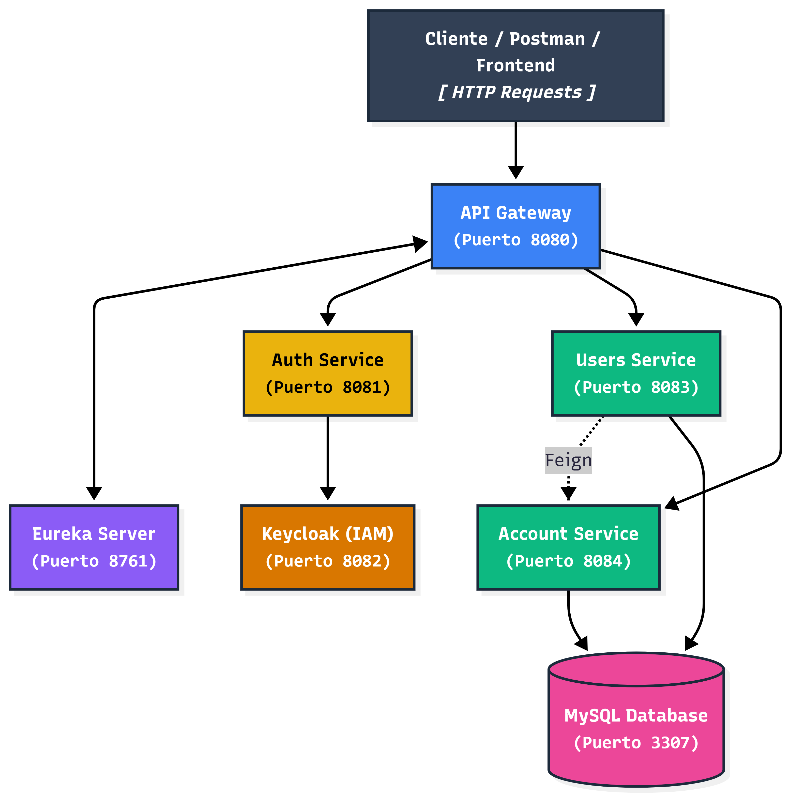

# Digital Money House 💳

Billetera digital desarrollada con arquitectura de microservicios, que permite a los usuarios registrarse, consultar saldos, ver su actividad, transferir dinero entre cuentas, ingresar dinero desde una tarjeta y gestionar su información de manera segura mediante autenticación basada en JWT (Keycloak).

Proyecto desarrollado como Desafío Profesional de la Especialización Backend, entregado a lo largo de 4 sprints.

## Tabla de contenidos
- [Tecnologías utilizadas](#tecnologías-utilizadas)
- [Arquitectura del sistema](#arquitectura-del-sistema)
- [Requisitos previos](#requisitos-previos)
- [Configuración inicial](#configuración-inicial)
- [Puertos](#puertos)
- [Endpoints principales](#endpoints-principales)
- [Documentación API](#documentación-api)
- [Testing](#testing)
- [Buenas prácticas y decisiones de diseño](#buenas-prácticas-y-decisiones-de-diseño)
- [Sprints completados](#sprints-completados)
- [Estructura del repositorio](#estructura-del-repositorio)

## Tecnologías utilizadas

- Java 21
- Spring Boot 3.5.x
- Spring Cloud (Eureka, API Gateway, OpenFeign)
- Keycloak (autenticación e identidad, JWT)
- MySQL
- Docker / Docker Compose
- spring-dotenv (carga de variables de entorno)
- Swagger / OpenAPI
- JUnit 5, RestAssured, Allure (testing automatizado)
- Postman (testing manual)
- Git / GitHub

## Arquitectura del sistema

El sistema está compuesto por 5 microservicios independientes registrados en Eureka y expuestos a través de un único punto de entrada (API Gateway), que valida los tokens JWT emitidos por Keycloak antes de enrutar las peticiones.



**Flujo general:**
- El cliente (Postman / Frontend) envía todas las peticiones al **API Gateway** (puerto 8080).
- El Gateway valida el JWT y enruta hacia **Auth Service**, **Users Service** o **Account Service** según corresponda.
- **Users Service** y **Account Service** persisten en la misma base de datos **MySQL** (puerto 3307).
- **Users Service** se comunica con **Account Service** vía **Feign** (comunicación interna entre microservicios).
- **Auth Service** delega la autenticación en **Keycloak** (puerto 8082).
- Todos los servicios se registran en **Eureka Server** (puerto 8761) para service discovery.

## Requisitos previos
- Java 21+
- Docker y Docker Compose
- IntelliJ IDEA (recomendado)
- Maven (para correr la suite de testing automatizado)

## Configuración inicial

### 1. Clonar el repositorio
```bash
git clone https://github.com/IsaMontoya17/Digital-Money-House.git
cd Digital-Money-House
```

### 2. Crear archivo .env
Crear un archivo `.env` en la raíz del proyecto con las siguientes variables:

```env
DB_ROOT_PASSWORD=root1234
DB_NAME=digital_money_house
DB_USERNAME=dmh_user
DB_PASSWORD=dmh1234
KEYCLOAK_ADMIN=admin
KEYCLOAK_ADMIN_PASSWORD=admin1234
KEYCLOAK_CLIENT_SECRET=misuperclave123
```

### 3. Levantar MySQL y Keycloak
```bash
docker-compose up -d
```

> Si necesitas reiniciar el entorno desde cero (borrar BD y Keycloak), usá `docker compose down -v` y luego `docker compose up -d` nuevamente.
>
> El realm de Keycloak se importa automáticamente al levantar el contenedor a partir de `realm-export.json`, por lo que no es necesario configurarlo manualmente.

### 4. Levantar los microservicios
Correr en este orden desde IntelliJ:
1. `eureka-server`
2. `api-gateway`
3. `users-service`
4. `auth-service`
5. `account-service`

## Puertos
| Servicio | Puerto |
|----------|--------|
| Eureka Server | 8761 |
| API Gateway | 8080 |
| Auth Service | 8081 |
| Keycloak | 8082 |
| Users Service | 8083 |
| Account Service | 8084 |
| MySQL | 3307 |

## Endpoints principales

Todas las peticiones se hacen contra el API Gateway (`http://localhost:8080`).

### Usuarios y autenticación
| Método | Endpoint | Descripción | Auth |
|--------|----------|-------------|------|
| POST | /users/register | Registro de usuario | No |
| POST | /auth/login | Login | No |
| POST | /auth/logout | Logout | Bearer Token |
| GET | /users/{id} | Consultar perfil de usuario | Bearer Token |
| PATCH | /users/{id} | Actualizar datos de usuario | Bearer Token |

**Ejemplo — POST /users/register**

Request:
```json
{
  "nombre": "Ana",
  "apellido": "Pérez",
  "email": "ana@mail.com",
  "password": "segura123"
}
```

Response `201 Created`:
```json
{
  "id": 1,
  "email": "ana@mail.com",
  "cvu": "00000000000000000001",
  "alias": "ana.perez.dh"
}
```

### Cuentas, actividad y transferencias
| Método | Endpoint | Descripción | Auth |
|--------|----------|-------------|------|
| GET | /accounts/user/{keycloakId} | Consultar cuenta por keycloak_id | Bearer Token |
| GET | /accounts/{id} | Consultar saldo de cuenta | Bearer Token |
| PATCH | /accounts/{id} | Actualizar alias de cuenta | Bearer Token |
| GET | /accounts/{id}/transactions | Listar transacciones (más reciente primero) | Bearer Token |
| GET | /accounts/{id}/activity | Historial completo de actividad | Bearer Token |
| GET | /accounts/{id}/activity/{transactionId} | Detalle de una transacción | Bearer Token |
| POST | /accounts/{id}/transferences | Ingresar dinero desde tarjeta | Bearer Token |
| GET | /accounts/{id}/transfers | Últimos 5 destinatarios (sin duplicados) | Bearer Token |
| POST | /accounts/{id}/transfers | Transferir dinero a otra cuenta | Bearer Token |

**Ejemplo — POST /accounts/{id}/transfers**

Request:
```json
{
  "destinationAccountId": 8,
  "amount": 1500.00,
  "description": "Pago compartido"
}
```

Response `200 OK`:
```json
{
  "transactionId": 42,
  "originAccountId": 3,
  "destinationAccountId": 8,
  "amount": 1500.00,
  "date": "2026-07-18T15:32:10"
}
```

Validaciones aplicadas: propiedad de la cuenta origen (a partir del `sub` del JWT), existencia de la cuenta destino, prevención de auto-transferencia y verificación de saldo suficiente. Si el saldo es insuficiente, la API responde `410 Gone`.

> **Nota:** el endpoint de transferencia entre cuentas se nombró `/transfers` (y no `/transferences`) para no colisionar con el endpoint de ingreso de dinero desde tarjeta, ya existente desde el Sprint 3.

### Tarjetas
| Método | Endpoint | Descripción | Auth |
|--------|----------|-------------|------|
| POST | /accounts/{id}/cards | Crear y asociar tarjeta a una cuenta | Bearer Token |
| GET | /accounts/{id}/cards | Listar tarjetas de una cuenta | Bearer Token |
| GET | /accounts/{id}/cards/{cardId} | Detalle de una tarjeta | Bearer Token |
| DELETE | /accounts/{id}/cards/{cardId} | Eliminar tarjeta de una cuenta | Bearer Token |

> **Nota:** en Sprint 1, `GET /accounts/user/{id}` recibía el id numérico de usuario. Desde Sprint 2 recibe el `keycloak_id` (UUID), extraído del claim `sub` del JWT.

## Documentación API
- Users Service: http://localhost:8083/swagger-ui/index.html
- Auth Service: http://localhost:8081/swagger-ui/index.html
- Account Service: http://localhost:8084/swagger-ui/index.html

## Testing

### Testing manual
📋 [Ver planilla de casos de prueba en Google Sheets](https://docs.google.com/spreadsheets/d/18RXRqorzNwusKFIdgUL_-Ky4-OdwckKh/edit?usp=sharing&ouid=109883533115129275755&rtpof=true&sd=true)

La planilla incluye Smoke Test + Regression Test con la siguiente convención de IDs:
- `TC-SM-XXX` → Smoke Test
- `TC-RG-XXX` → Regression Test

Cada hoja incluye precondiciones, datos de prueba, pasos, resultado esperado/obtenido y estado de ejecución.

Documentación complementaria de QA entregada en Sprint 4:
- `Casos_Prueba_Sprint4.xlsx` — casos de smoke (TC-SM-016 a TC-SM-019) y regresión (TC-RG-066 a TC-RG-085) con evidencia.
- `Testing_Exploratorio_Sprint4.docx` — 3 sesiones de testing exploratorio.
- `QA_Sign_Off_Sprint4.docx` — métricas finales, defectos y estado de cierre del sprint.

### Testing automatizado

La suite de pruebas automatizadas vive en el módulo `testing-automation/`, separado de los microservicios. Usa **Java + RestAssured + JUnit 5**, con reportes generados vía **Allure**.

**Requisitos:** el stack completo (Eureka, Gateway, Keycloak, MySQL y los 3 microservicios) debe estar levantado antes de correr los tests, ya que ejecutan llamadas HTTP reales contra la API.

**Ejecutar la suite:**
```bash
cd testing-automation
mvn clean verify
```

Esto corre todos los tests que siguen la convención `**/*TestSuite.java` y genera automáticamente el reporte de Allure al finalizar (plugin configurado en la fase `post-integration-test`).

**Ver el reporte manualmente:**
```bash
mvn allure:serve
```

**Estructura del módulo:**
```
testing-automation/
└── src/test/java/com/digitalmoneyhouse/testing/
    ├── config/    → TestConfig: URLs y credenciales de prueba
    ├── utils/     → AuthHelper (login/token), DbHelper (seed de datos vía JDBC), RegressionHelpers
    ├── smoke/     → SmokeTestSuite
    └── regression/→ suites de regresión por dominio (users, accounts, cards, transfers)
```

**Resultado de la última corrida completa (Sprint 4):** 104 tests ejecutados, 101 aprobados y 3 omitidos por diseño (1 deprecado y 2 que requieren esperar ~300 segundos por expiración de token).

## Buenas prácticas y decisiones de diseño

- **Identidad desde el JWT:** los servicios extraen la identidad del usuario a partir del claim `sub` del token validado (`@AuthenticationPrincipal Jwt jwt`), en lugar de confiar en headers como `X-User-Id`, que fue detectado como una vulnerabilidad de escalamiento de privilegios y eliminado.
- **Prevención de colisiones de rutas:** antes de sumar nuevos endpoints se revisan las rutas existentes; por eso `/transfers` se separó de `/transferences`.
- **Manejo de errores:** `GlobalExceptionHandler` centraliza excepciones de negocio (`InsufficientFundsException` → `410 Gone`) y de formato (`HttpMessageNotReadableException` por enums inválidos → `400 Bad Request` en lugar de `500`).
- **Formato de alias de cuenta:** `palabra.palabra.palabra`; no se permiten sufijos numéricos.
- **Consistencia de datos:** el campo `userId` en la tabla `accounts` usa el UUID de Keycloak (`varchar(36)`), no el id numérico de la base de datos.
- **Logging:** se agregó configuración de logging estructurado vía `logback-spring.xml` en los microservicios.
- **Testing:** los tests se escriben contra el contrato real de los DTOs desde el inicio, y cada usuario de prueba usa su propio token (evita falsos `403` por tokens compartidos).

## Sprints completados

### Sprint 1 ✅
- Registro de usuarios con generación de CVU y alias
- Login con token JWT vía Keycloak
- Logout invalidando sesión en Keycloak
- Eureka Server para service discovery
- API Gateway con enrutamiento y seguridad

### Sprint 2 ✅
- Consulta de saldo de cuenta (`GET /accounts/{id}`)
- Listado de transacciones ordenadas por fecha (`GET /accounts/{id}/transactions`)
- Consulta de perfil de usuario con CVU y alias (`GET /users/{id}`)
- Actualización de datos de usuario con sincronización a Keycloak (`PATCH /users/{id}`)
- Actualización de alias de cuenta con validación de formato (`PATCH /accounts/{id}`)
- Gestión completa de tarjetas: alta, listado, detalle y eliminación
- Migración de `GET /accounts/user/{id}` a `GET /accounts/user/{keycloakId}`
- Validación a nivel de Gateway con `KeycloakJwtConverter` y `TokenRelay`
- Suite de testing automatizado con RestAssured + Allure

### Sprint 3 ✅
- Historial completo de actividad de cuenta ordenado por fecha (`GET /accounts/{id}/activity`)
- Detalle de una transacción específica (`GET /accounts/{id}/activity/{transactionId}`)
- Ingreso de dinero desde tarjeta asociada con actualización de saldo (`POST /accounts/{id}/transferences`)
- Suite de smoke tests refactorizada con IDs dinámicos (sin hardcoding)
- Testing exploratorio documentado con sesiones, charters y hallazgos
- Planilla de casos de prueba actualizada: 15 smoke tests, 65 regression tests

### Sprint 4 ✅ (Final)
- Transferencias entre cuentas (`GET` y `POST /accounts/{id}/transfers`), con últimos 5 destinatarios deduplicados y validación completa (propiedad, existencia de destino, auto-transferencia, saldo insuficiente → `410`)
- Manejo centralizado de nuevas excepciones en `GlobalExceptionHandler`
- Logging estructurado vía `logback-spring.xml`
- Suite de regresión ampliada a 85 casos (TC-RG-066 a TC-RG-085 nuevos)
- Cierre de QA con 104 tests ejecutados, 101 aprobados, 3 omitidos por diseño, 100% automatizado
- Documentación de QA final: casos de prueba, testing exploratorio y sign-off del sprint

## Estructura del repositorio
```
├── README.md
├── docs/
│   └── arquitectura.png
├── eureka-server/
├── api-gateway/
├── auth-service/
├── users-service/
├── account-service/
├── testing-automation/
├── docker-compose.yml
└── realm-export.json
```